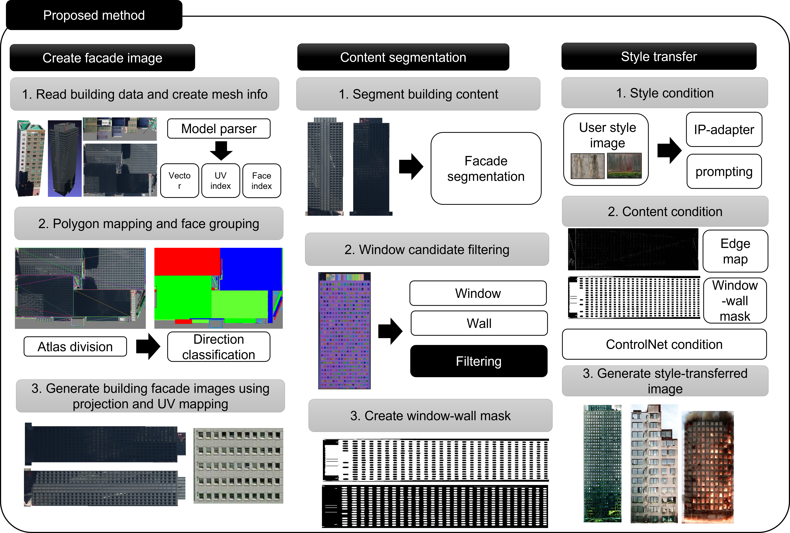
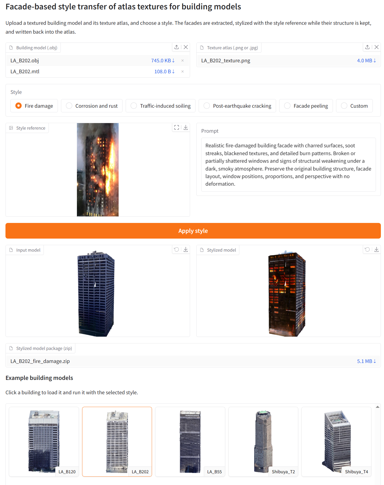

# Atlas-Aware Facade Style Transfer for 3D Building Models

**"A Facade-Based Pipeline for Structure-Preserving Style Transfer of Atlas Textures for Building Models"**

This repository provides a demo implementation of an atlas-aware, facade-based texture style-transfer pipeline for existing textured 3D building models.

The pipeline converts fragmented texture atlases into facade-aligned images, applies structure-preserving diffusion-based stylization, and reconstructs the stylized facades into the original texture-atlas layout while retaining the original building geometry, UV coordinates, and material assignments.

## Overview

<p align="center">
  
</p>

The pipeline modifies the texture appearance only and does not require remeshing of the source building asset.

## Demo overview
<p align="center">
  
</p>

The demo supports five scenario-oriented facade appearance presets:

- Fire damage
- Corrosion and rust
- Traffic-induced soiling
- Post-earthquake cracking
- Facade peeling

(A custom reference image and text prompt can also be used to specify the target appearance)

## Tested environment:
- Ubuntu 22.04
- NVIDIA RTX 4090 24 GB
- Python 3.10
- PyTorch 2.6.0 + CUDA 12.4

## Installation

```bash
git clone https://github.com/IngIeoAndSpare/Style_transfer_for_Building_model.git
cd Style_transfer_for_Building_model

python3 -m venv venv
source venv/bin/activate

pip install --upgrade pip

pip install torch==2.6.0 torchvision==0.21.0 \
    --index-url https://download.pytorch.org/whl/cu124

# no weights are downloaded
bash scripts/setup_engine.sh
pip install -r requirements.txt
```


## Thanks to
We thank the authors of [StyleCity3D](https://github.com/chenyingshu/stylecity3d) for providing the public 3D scene data. Example buildings used in our public demo were extracted and prepared from the Tokyo (Shibuya) and Los Angeles scenes released with StyleCity3D.